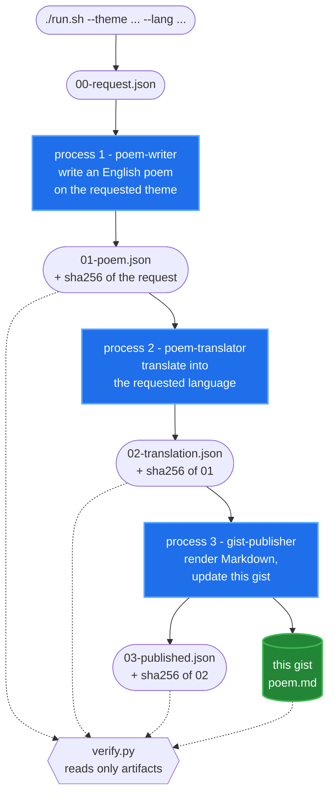

# How this poem got here

The `poem.md` in this gist was written by one AI agent, translated by a second,
and published by a third — three separate processes that never shared a context.
The only thing that crossed between them was a file on disk.

**Repo:** https://github.com/GoldenMaximo/Claude-Skill-Orchestration-Pipeline-Poem

The whole of it was one command:

```bash
./run.sh --theme "a Nissan Silvia S13 with an RB25 Turbo engine that whistles" --lang Japanese
```



## Why the boundaries are processes, not instructions

Telling an agent "ignore what you saw earlier" is a request it can decline.
Starting a new process means there is nothing to ignore — step 2 structurally
cannot see step 1's reasoning, only the file it left behind. If the chain still
works under that constraint, the file is provably the channel, because there is
nothing else it could have been.

## Why a transcript is not evidence

Each step records the SHA-256 of the file it read. `verify.py` recomputes those
hashes from disk and compares:

| Check | What it catches |
|---|---|
| `EXISTS` | the step never ran, whatever it said |
| `CHAINED` | the step ran but invented its input instead of reading it |
| `HONEST` | the transcript claims success while the artifact is missing |
| `ASKED` | the theme or language was quietly dropped somewhere in the chain |
| `SERVED` | the gist doesn't actually hold what the run produced |

`SERVED` is the one that applies to this page. A step can write
`"gist_url": "…"` into its own output file without ever calling the API — that's
a claim, not proof. So the verifier fetches this gist and compares the bytes it
serves against the local render. Anything less is taking the model's word for it.

A step that ran and failed still writes its file, with the reason inside. Failing
loudly and never running at all have to look different, or the whole scheme is
decoration.
